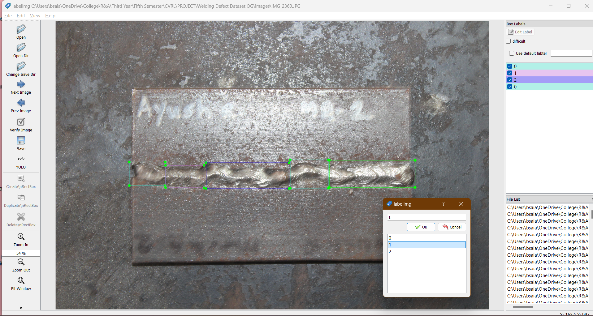
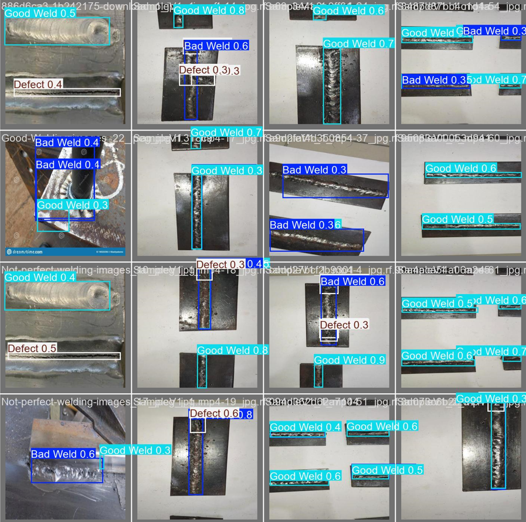

# Weld Quality Detection using Computer Vision

**An object detection project for identifying and localizing defects in welding seams using Computer Vision (CV) and the Ultralytics YOLOv8 framework.**

## 💡 Overview

This project implements a robust solution for automated inspection of welding quality. By leveraging the **YOLOv8 (You Only Look Once)** object detection model, it can accurately identify various critical weld defects in images and in a real-time video stream.

The core of the project involves training a custom model on a specialized dataset containing images of high-quality welds and common weld defects. This technology can significantly reduce manual inspection time and improve quality control in manufacturing and fabrication processes.

## 🛠️ Technology Stack

* **Model:** YOLOv8n (Nano) - Chosen for its balance of speed and accuracy, suitable for real-time applications.
* **Framework:** PyTorch & Ultralytics
* **Language:** Python
* **Libraries:** `ultralytics`, `torch`, `opencv-python` (cv2), `pyyaml`
* **Annotation Tool:** LabelImg (used for manual bounding box annotation)

## 📊 Dataset & Preparation

The model was trained on a comprehensive and unique dataset meticulously prepared for this task:

1.  **Kaggle Base:** A portion of images was sourced from existing public weld defect datasets.
2.  **Custom Workshop Data:** The majority of the dataset comprises **high-resolution images** manually captured from the college workshop using a DSLR camera. This ensures the model is robust to real-world, localized variations specific to our environment.
3.  **Annotation:** Images (Manually clicked) were manually labeled using **LabelImg** to create precise bounding boxes and class labels for each type of weld defect (e.g., *bad weld*, *defect*, *good weld*).
4.  **Format:** The dataset is configured in the standard YOLO format, defined by the `data.yaml` configuration file.

## 👨‍💻 Contributors

- **Sai Ansh Batho** - [LinkedIn](https://www.linkedin.com/in/sai-ansh-batho-aa3327256/)
- **Jay Shejwal** - [LinkedIn](https://www.linkedin.com/in/jay-s-80187b202/)

## 🤝 Contributing

Pull requests are welcome! For major changes, please open an issue first to discuss what you’d like to change.

## 📷 Preview

---
